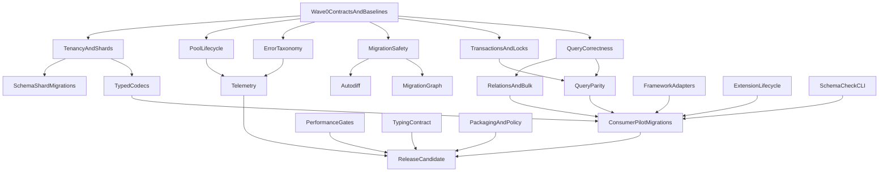

# Ferrum Production Readiness Plan

## Execution control

- Goal: `.cursor/goals/ferrum-production-readiness.md`
- Aggregate state: `.agent-work/production-readiness/state/index.yaml`
- Authoritative execution protocol: `.agent-work/production-readiness/PROTOCOL.md`
- Task, run-log, and verification contracts:
  `.agent-work/production-readiness/README.md`
- Coordinator: `production-readiness-coordinator`
- Executor: `production-readiness-executor` plus the relevant domain specialist
- Independent gate: `production-readiness-verifier`
- Named authority gates remain `chief-architect`, `security-engineer`,
  `product-manager`, and `code-reviewer`; the generic verifier cannot replace them.
- Recurring coordination: `/loop /production-readiness-loop`

Every workstream follows `Specify → Plan → Tasks → Implement`. Every executor run
follows `Load → Execute → Validate executor output → Verify independently → Update state`.
Per-workstream state carries detailed progress; this plan's frontmatter changes only
when an entire top-level todo changes status.

## Scope and fixed decisions

- Ferrum remains async-native; do not add sync sessions, greenlet bridges, or blocking wrappers.
- PostgreSQL is the production target. Existing thin dialect support must not shape or delay PostgreSQL correctness.
- Python owns pools, transactions, routing, retries, codecs, hooks, and DX; Rust remains a pure synchronous compiler/codec.
- Preserve explicit `ConnectionLike` arguments. Do not add global implicit sessions or a SQLAlchemy-style identity map.
- Do not add raw-SQL query escape hatches. Close consumer gaps with typed ORM operations, allowlisted helpers, or stored-function calls.
- Support both required tenancy models:
  - Ticket Analyzer: RLS with transaction-local GUCs.
  - Org AI Platform: validated transaction-local schema selection plus multiple shard pools.
- During Org AI migration, Alembic may remain schema authority. Ferrum must provide runtime ORM parity and drift validation before Ferrum migration ownership is attempted.

## Release gates

Ferrum is not production-ready for these consumers until all P0 gates pass:

1. SQL/write correctness and PostgreSQL type fidelity.
2. Transaction-boundary retry semantics and locking primitives.
3. Atomic, lock-guarded migrations.
4. Diagnosable but sanitized database errors.
5. Pool timeout/failover/shutdown behavior and real telemetry.
6. RLS, schema-tenant, shard, custom-codec, and consumer contract suites on live PostgreSQL.
7. Compiler-free Python 3.14 wheel installation on consumer runtime images.

## Wave 0: contracts and baselines

Run these workstreams in parallel before public API implementation.

### W0-A — Architecture and compatibility contracts

Update `AGENTS.md`, `README.md`, and the architecture/production plans under `.cursor/plans/`:

- Correct ADR-004: current migration apply is autocommit-per-operation, not transactional.
- Define retry scope: statement retry only for safe autocommit reads; transaction retries replay the entire callback.
- Define safe error fields: SQLSTATE, category, constraint, model, operation; never PostgreSQL `DETAIL`, `HINT`, values, rows, or DSNs.
- Define schema tenancy and sharding boundaries: validated schema selection on a pinned transaction; caller/router chooses a shard connection.
- Publish an alpha-to-stable compatibility policy covering public APIs, serialized IR, generated SQL, migration files, and deprecation windows.
- Explicitly reject an identity map, implicit lazy I/O, and unrestricted SQL as migration goals.

Security review is mandatory for migration apply, error surfaces, RLS/admin GUCs, and schema selection.

### W0-B — Consumer parity inventory

Create executable parity manifests under `tests/consumer_contracts/` from actual usage in both consumers:

- Ticket Analyzer: RLS transactions, platform-admin bypass, composite keys, CAS/update-returning, inbox leases, JSONB filters, arrays, pgvector, bulk upsert/update, streaming, stored functions, nullable predicates, and aggregates.
- Org AI Platform: schema-per-tenant, shard routing, row locks/`SKIP LOCKED`, complex relation filters, custom encrypted/JSON types, Pydantic JSON payloads, server defaults, large bulk paths, FastAPI auth persistence, and migration/drift workflows.
- Classify each call site as supported, defect, missing Ferrum API, or consumer refactor. This prevents implementing SQLAlchemy behavior that consumer code can safely remove.

### W0-C — Reproducible baselines

Extend `mise.toml` with stable tasks for live PostgreSQL contracts, wheel-install smoke tests, end-to-end benchmarks, and full `ci-local`. Record current correctness and p50/p95/p99 baselines before optimization.

## Wave 1: blocking foundations

The following workstreams are independent after Wave 0 and should run concurrently with strict file ownership.

### W1-A — Query and write correctness

Owner: Rust compiler + QuerySet tests.

Files: `python/ferrum/queryset.py`, `crates/ferrum-sql/src/emit.rs`, core IR modules, query/security tests.

- Make `filter(field=None)` and `exclude(field=None)` compile to `IS NULL`/`IS NOT NULL`, matching Django semantics; keep explicit `__is_null` support.
- Fix and un-`xfail` `danger_delete_all`; verify no dangling `WHERE`.
- Add invariant tests proving slicing/order/limit can never widen UPDATE or DELETE scope.
- Build a table-driven PostgreSQL cast matrix matching migration DDL exactly: UUID, numeric/Decimal, arrays, JSON/JSONB, enum, timestamp/date/time, bytea, tsvector, inet, and vector.
- Add golden IR-to-SQL tests and live-PostgreSQL round trips for create, filter, join, update, bulk update, upsert, and hydration for every supported type.
- Fuzz malformed fields/operators/sort directions and prove failure before SQL emission.

### W1-B — Transactions, retries, and concurrency control

Owner: Python connection/runtime layer.

Files: `python/ferrum/connection.py`, `python/ferrum/runtime.py`, PostgreSQL driver and transaction tests.

- Disable statement-level retries on a pinned transaction; PostgreSQL transactions are aborted after relevant failures.
- Add an explicit transaction replay API such as `run_transaction(fn, retry=...)` that creates a fresh transaction per attempt, retries only allowlisted SQLSTATE categories, uses capped exponential backoff with jitter, respects cancellation/deadline, and documents idempotency requirements.
- Retain no-retry default behavior.
- Add `select_for_update(nowait=False, skip_locked=False, of=...)` and verify lock behavior with concurrent live-PostgreSQL tests.
- Add typed advisory-lock helpers with validated integer/string keys and transaction/session scope.
- Verify nested savepoints, cancellation rollback, serialization/deadlock replay, and no connection leaks.

### W1-C — Migration execution safety

Owner: migrations subsystem only.

Files: `python/ferrum/migrations/orchestrator.py`, `python/ferrum/migrations/ledger.py`, `python/ferrum/migrations/operations.py`, CLI migration commands and tests.

- Acquire a stable PostgreSQL advisory lock before checking or mutating the migration ledger.
- Execute each transactional migration and its ledger write atomically on one pinned connection.
- Split explicitly non-transactional operations into validated phases; support `CREATE INDEX CONCURRENTLY` without pretending it is rollback-safe.
- Add configurable `lock_timeout`, `statement_timeout`, lock-holder diagnostics, and actionable failure context.
- Make checksum/dependency validation race-safe; reject changed applied files and conflicting concurrent migrators.
- Test process interruption, failed operation rollback, lock contention, duplicate runners, cancellation, transactional DDL, and non-transactional partial failure.
- Preserve mandatory dry-run, destructive confirmation, environment confirmation, and redaction gates.

### W1-D — Error taxonomy and diagnostics

Owner: centralized error boundary.

Files: `python/ferrum/errors.py`, PyO3 boundary, hook/error tests.

- Add structured `sqlstate` and stable `category` attributes to database errors without exposing server detail/hint or submitted values.
- Map integrity, schema, serialization, deadlock, lock timeout, query cancellation, pool exhaustion, failover/admin shutdown, invalid transaction state, and connection classes.
- Preserve the original Ferrum exception as the public boundary and safe exception chaining policy.
- Feed structured categories into Tier-A hooks and retry decisions.
- Add security tests using secrets and row data in PostgreSQL error detail/hint to prove they never escape.

### W1-E — Pool lifecycle and configuration

Owner: driver/pool layer.

Files: `python/ferrum/drivers/postgres.py`, `python/ferrum/connection.py`, driver protocols and integration tests.

- Enforce `acquire_timeout` on every path, including pool convenience `fetch`/`execute` calls.
- Separate and correctly name idle lifetime versus hard connection max age; add configurable command timeout, statement cache, TLS/SSL, `server_settings`, and `application_name`.
- Add failover-safe connection validation/replacement behavior; do not pre-ping every query unless benchmarks justify it.
- Replace shutdown busy polling with event/condition signaling; report forced drain timeout and close active streams deterministically.
- Expose a typed `PoolStats` snapshot: size, idle, acquired, waiters if available, configured min/max, in-flight operations, accepting/closing state.
- Add saturation, cancellation, failover/restart, stale connection, growth, and shutdown tests.

### W1-F — RLS, platform administration, schema tenancy, and shards

Owner: session/routing APIs.

Files: `python/ferrum/session.py`, new routing module, exports, security/integration tests.

- Keep tenant GUCs transaction-local and add a dedicated `platform_admin_transaction()` that sets only allowlisted admin state and does not require a fake tenant ID.
- Do not add a `platform_scoped` model flag: ordinary Ferrum models already represent non-RLS tables. Access control belongs to the transaction/session boundary.
- Add `schema_transaction(schema, ...)` using strict PostgreSQL identifier validation and transaction-local `search_path`; reset is guaranteed by transaction end and pool reuse tests.
- Add an optional `ConnectionRegistry`/`ShardRouter` that owns independently configured pools, resolves a trusted shard key, supports bounded parallel startup/health/close, and reports per-shard health/stats. QuerySet remains unaware of routing and still receives an explicit connection/transaction.
- Add cross-tenant, cross-schema, and cross-shard leak tests, including cancellation and pool reuse.

## Wave 2: consumer capability parity

Start after Wave 1 interfaces stabilize. Workstreams can run in parallel.

### W2-A — Typed field codecs and PostgreSQL types

- Introduce a typed Python-side `FieldCodec` contract for bind/result conversion without moving I/O into Rust.
- Support nested Pydantic models/lists stored in JSONB, encrypted string/JSON codecs with key-provider injection, citext, inet, bytea, arrays, enums, vector dimensions, and custom PostgreSQL domains.
- Ensure hydration constructs declared nested types correctly despite the trusted DB fast path.
- Codec metadata must be immutable, IDE-visible, migration-aware, and excluded from logs/hooks/errors.
- Add deterministic and randomized round-trip tests, key rotation/failure tests, malformed ciphertext behavior, and PII redaction tests.

Files: `python/ferrum/models.py`, hydration/queryset paths, Rust type metadata, migration type mapping, stubs, tests.

### W2-B — Query expressiveness required by Org AI

Implement only parity-manifest-backed APIs:

- Multi-hop relation lookup compilation with deterministic aliases and cycle/depth limits.
- `exists`/`not exists` subqueries, scalar subqueries, typed joins/projections, conditional expressions, database functions, and reusable expressions.
- Grouping/having, filtered aggregates, window functions, CTEs, and UNION only where consumer queries require them.
- Preserve immutable QuerySets, allowlisted identifiers, bound values, SQL fingerprints, and write-scope safety.
- Add query-plan and index-usage checks for hot consumer paths; prevent accidental N+1 and unbounded materialization.

Files: QuerySet/IR/Rust SQL emitter and dedicated expression modules/tests. Do not add `raw()`, `extra()`, or string fragments.

### W2-C — Relationship and bulk behavior

- Finish reverse FK/one-to-one/many-to-many loading, nested `select_related`/`prefetch_related`, through models, ordering, and bounded batching.
- Keep relation access explicit: unloaded relations raise rather than performing hidden async I/O.
- Harden bulk create/upsert/update/delete for composite keys, per-row values, conflict predicates, returning, batch sizing, and PostgreSQL parameter limits.
- Document cascade behavior as database-driven; do not emulate SQLAlchemy unit-of-work cascades.
- Benchmark memory and latency for Ticket Analyzer backfills and Org AI batch workloads.

### W2-D — FastAPI and authentication integrations

- Harden the existing FastAPI lifespan/dependency integration for one pool per process and transaction-scoped request dependencies.
- Add an optional `fastapi-users` database adapter backed by Ferrum models/querysets if the Org AI parity inventory confirms continued use.
- Cover user lookup/create/update/delete, unique conflicts, OAuth account relations, transaction ownership, and error translation.
- Keep framework integrations in optional extras; core Ferrum must not import FastAPI or fastapi-users.

### W2-E — pgvector and extension lifecycle

- Add declarative connection initializers/codecs so pgvector registration occurs uniformly for current and future pooled connections; optionally enable through `connect(..., extensions=[pgvector])`.
- Keep explicit dimensions/metric typing and verify insert/update/bulk/KNN paths.
- Generalize the initializer mechanism for citext or consumer-defined codecs without exposing raw connections.
- Test pool growth, reconnect/failover, initializer failure, and mixed extension availability.

### W2-F — Schema drift and compatibility CLI

- Add `ferrum check-schema` with non-zero exit on model/live-schema drift and machine-readable output.
- Compare columns, exact PostgreSQL types, nullability/defaults, PK order, unique/FK/check constraints, indexes/opclasses/predicates, extensions, RLS policies, functions, and vector dimensions.
- Support explicit unmanaged table/schema exclusions for Better Auth, LangGraph, and Alembic-owned objects.
- Add an Alembic coexistence guide: Alembic remains authoritative, Ferrum checks drift, and no historical revision conversion is required.

Files: `python/ferrum/migrations/drift.py`, CLI, docs, live-schema fixtures.

## Wave 3: migration maturity and operations

These can run in parallel after safe execution from W1-C lands.

### W3-A — Migration graph and reversibility

- Add explicit dependencies, deterministic topological ordering, target upgrades/downgrades, checksum enforcement, status/history, and recovery guidance.
- Implement reversible rename/type/default/nullability/constraint/index operations with destructive/type-narrowing classification.
- Add explicit data migration callables with transaction policy and no automatic source-code execution from untrusted files.
- Generate offline SQL with checksums and phase annotations.

### W3-B — Schema/shard migration coordinator

- Apply one migration graph across selected schemas/shards with per-target advisory locks, bounded concurrency, resumable status, and fail-fast/continue policy.
- Never promise cross-shard atomicity. Report partial rollout precisely and make reruns idempotent.
- Add canary-target support and structured progress hooks.

### W3-C — Autodiff quality

- Extend autodiff for types, renames via explicit hints, constraints, relations, indexes, extensions, RLS, and functions.
- Never guess ambiguous renames or destructive conversions; require developer intent.
- Add schema-state replay and round-trip tests from empty schema through upgrade/revert.

## Wave 4: observability, performance, typing, and release

Run concurrently after Wave 1 event/error contracts stabilize.

### W4-A — Real OpenTelemetry and metrics

Files: `python/ferrum/observability.py`, hooks and execution seams.

- Create one span around actual query execution rather than zero-duration event spans; preserve ambient parent context.
- Emit low-cardinality query, transaction, pool, migration, retry, timeout, and error metrics from Tier-A-safe fields.
- Do not put query fingerprints into default metric labels; provide opt-in exemplars/sampling to avoid cardinality explosions.
- Emit pool acquire/release/wait/timeout and shutdown events from real lifecycle points.
- Provide Prometheus/OTel examples and verify no values, DSNs, credentials, or row data under default telemetry.

### W4-B — End-to-end performance and regression gates

- Benchmark Ferrum versus raw asyncpg and SQLAlchemy async on identical schemas/workloads: point reads, filtered pages, relation loads, writes, bulk operations, JSONB, vector KNN, streaming, and transactions.
- Measure throughput, p50/p95/p99, CPU, allocations, memory peak, pool saturation, and compile/hydration split.
- Profile the JSON/msgpack boundary and hydration validation copy before changing IR/wire formats; any wire change requires a versioned compatibility decision.
- Add stable threshold/regression reporting to nightly CI; avoid flaky hard gates until variance is characterized.

### W4-C — Typing and IDE contract

- Verify strict `ty`, Pyright/Pylance, and PyCharm behavior for `Model`, `QuerySet[T]`, projections, aggregates, relations, codecs, transactions, and contrib adapters.
- Replace dynamic surfaces with explicit generic protocols/stubs where necessary; keep `py.typed` and `_native.pyi` synchronized.
- Add compile-time fixture tests for accepted and rejected API use.

### W4-D — Packaging, supply chain, and release policy

- Build and install-test abi3 wheels without Rust/compiler fallback on Python 3.14 slim Linux; cover required manylinux architectures and macOS arm64. Add musllinux/Windows only if supported deployment targets justify them.
- Test sdist deliberately and fail wheel smoke tests if `uv` silently compiles from source.
- Run `cargo audit`, dependency review, SBOM/provenance generation, artifact signing/attestation, license checks, and secret scanning.
- Define supported PostgreSQL/Python versions, upgrade/deprecation policy, security reporting, release candidates, rollback/yank procedure, and changelog ordering.

## Integration and merge strategy

- Give each parallel agent exclusive ownership of its listed production files; shared exports/docs are merged by a coordinator after implementation branches land.
- Every workstream adds tests and docs in the same change. Public API changes include stubs and changelog entries.
- Merge Wave 1 in this order where shared contracts overlap: errors → pool/runtime → sessions → query compiler → migrations. Other branches rebase after the relevant contract merge.
- After each tranche: bump Ferrum version consistently, run scoped checks during development, then run full `mise run ci-local` before completion.
- Migration/error/RLS changes require dedicated security review. New routing/failure modes require architecture review.

## Consumer pilot gates

### Ticket Analyzer pilot

Replace its remaining SQLAlchemy backend persistence only after the Ferrum-owned contract suite proves:

- one Ferrum pool per process role;
- tenant and platform-admin transactions with no GUC leakage;
- inbox lease/CAS/`SKIP LOCKED` behavior under concurrency;
- JSONB, vector, bulk, composite-key, aggregate, and streaming parity;
- platform tables represented by ordinary Ferrum models and typed relations, without raw SQL.

Frontend Drizzle remains out of scope; it is not Python ORM duplication.

### Org AI Platform pilot

Refactor one vertical slice fully async before broad migration:

- one shard, public plus one tenant schema;
- Ferrum models/codecs for encrypted and Pydantic JSON fields;
- row locks, relations, auth adapter, and background worker path;
- Alembic remains migration authority while `ferrum check-schema` gates drift;
- compare correctness, query plans, latency, pool usage, and failure behavior with the existing SQLAlchemy path.

Expand by bounded domain slices and shards only after the pilot passes. Do not dual-write without an explicit reconciliation design.

## Definition of production-ready

- All P0 release gates and both consumer contract suites pass on live PostgreSQL under concurrency and cancellation.
- Full `mise run ci-local` is green; no known correctness `xfail` remains.
- Security review clears migration apply, SQL compilation, error redaction, RLS/admin, and schema-selection changes.
- End-to-end benchmarks show no unexplained material regression versus raw asyncpg/SQLAlchemy async baselines.
- Consumer pilots run on a single Python ORM pool with no raw SQL escape hatch added to Ferrum.
- Python 3.14 consumer images install a published wheel without a Rust toolchain.
- Public APIs, compatibility policy, operations guides, migration recovery, observability, and upgrade paths are documented.
