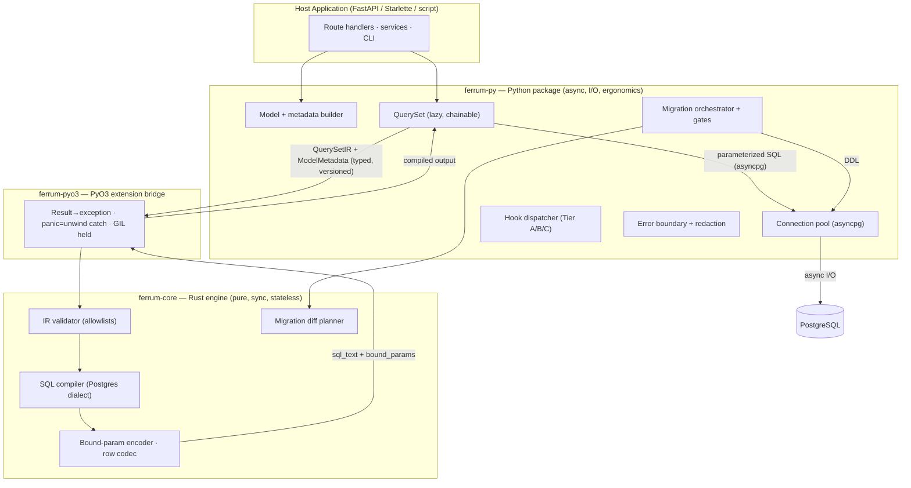
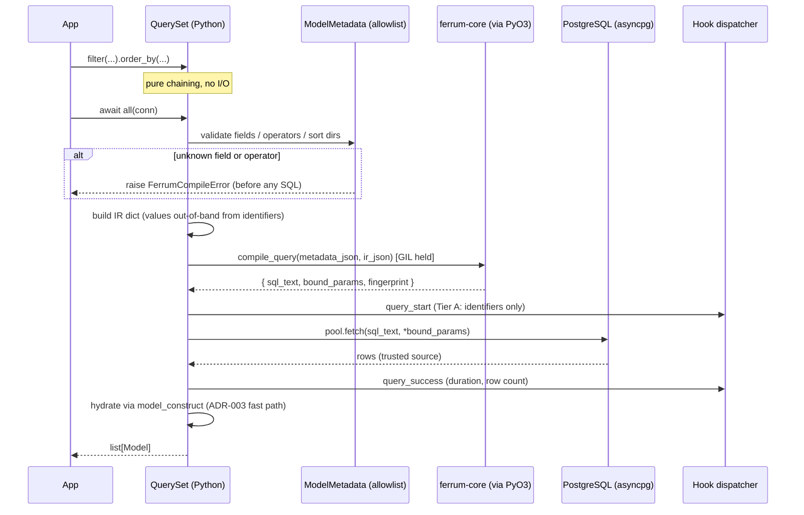
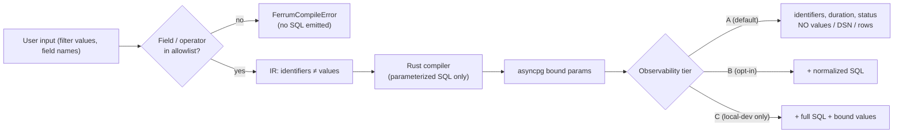
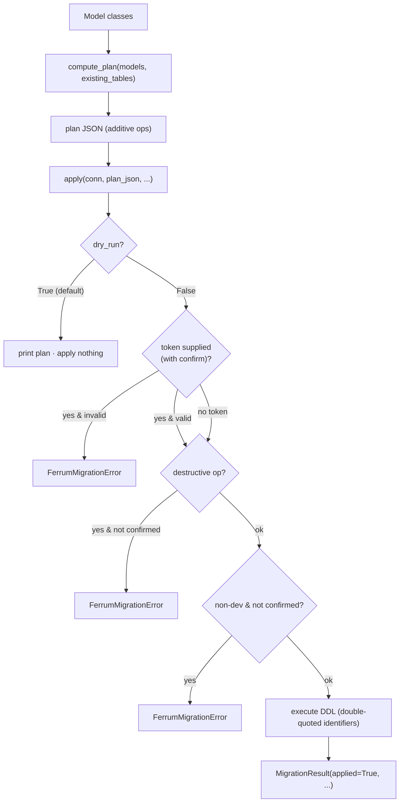

# Ferrum Architecture (public overview)

A developer-facing distillation of the internal architecture contract. Ferrum is an async
ORM **library** embedded in your Python process — not a standalone service. Its only
external dependencies are PostgreSQL and the host Python runtime.

> This is the public overview. The authoritative internal contract lives in
> `.claude/docs/ARCHITECTURE.md`.

---

## The layers

Ferrum splits cleanly along one seam: **Python owns ergonomics and async I/O; Rust owns
pure, synchronous compilation and codec work.**

**Who owns what**

| Concern | Owner | Why |
|---------|-------|-----|
| Public API, models, QuerySet | Python | Django/Pydantic mental model (Least Astonishment) |
| Connection pool, transactions, cancellation, timeouts | Python | I/O lives where failure scope is owned |
| Hook dispatch + payload redaction | Python | Non-bypassable redaction at dispatch |
| Migration apply + confirmation gates | Python | Destructive gates fire before SQL reaches the DB |
| IR validation + SQL compilation | Rust | CPU-bound, sub-millisecond, pure |
| Bound-param encoding + row hydration | Rust | Hot path, off the I/O thread |

Rust never performs I/O, never runs async, and holds no per-request mutable state. The
compile call holds the GIL and returns fresh owned output per call.

---

## The query lifecycle

How a `QuerySet` becomes rows. SQL is only ever built in Rust; Python builds the IR.

Key invariants visible here:

- **Allowlist gate first.** Field names, operators, and sort directions are checked against
  `ModelMetadata` in Python *before* the Rust compiler runs. Bad input fails as
  `FerrumCompileError` before any SQL exists.
- **Values travel out-of-band.** The IR carries identifiers (validated) separately from
  values (bound parameters). User strings never interpolate into SQL.
- **Trusted hydration.** Rows come from the DB, so the default path uses Pydantic's
  `model_construct` (skip re-validation) for speed (ADR-003).

---

## Security model (gates)

These are release-qualification gates, enforced and test-covered:

| Gate | Guarantee |
|------|-----------|
| **SQL safety** | No user input in identifier or value positions; identifiers from allowlists, values as bound params; bad input fails before emission. |
| **Credential handling** | DSNs/passwords never in hooks, errors, logs, or migration output. Connection diagnostics are an allowlist: host/port/db/user/category. |
| **Tiered observability** | Tier A by default. B/C require explicit `FERRUM_OBS` opt-in (never `DEBUG=1`). Tier C is local-dev only. |
| **Error boundary** | DB/PyO3/Postgres errors map to a sanitized Ferrum taxonomy. Panics become catchable exceptions, not aborts. |
| **Migration safety** | Mandatory dry-run; destructive + non-dev applies require explicit confirmation; unscoped writes require the named danger API. |

---

## Migration flow

The destructive gate **independently scans the ops** and never trusts the plan's own
`requires_confirmation` flag — a crafted plan JSON cannot lie its way past the gate. DDL
identifiers are always double-quoted and sourced from model-metadata allowlists; SQL types
and defaults are validated against fixed allowlists before interpolation.

---

## Crate / package map

| Component | Path | Role |
|-----------|------|------|
| `ferrum` (Python) | `python/ferrum/` | Public API: models, QuerySet, connection, errors, hooks, migrations, CLI, contrib. |
| `ferrum-pyo3` | `crates/ferrum-pyo3/` | PyO3 bridge. Exposes `compile_query`, `hydrate_rows`, `plan_migration`; maps `Result`/panics to catchable exceptions. |
| `ferrum-core` | `crates/ferrum-core/` | Pure engine: IR validator, compile + hydrate, migration planner. |
| `ferrum-sql` | `crates/ferrum-sql/` | SQL emitter (PostgreSQL dialect). |
| `ferrum-migrate` | `crates/ferrum-migrate/` | Migration planning support. |

The IR crossing the boundary is **typed, versioned, and serializable** (ADR-002 resolved),
with identifiers carried out-of-band from values so parameterization and allowlisting are
structural, not conventional.

---

## Architecture decisions (ADRs)

All original ADRs are resolved. The table below records the decisions for reference.

| ADR | Topic | Resolution |
|-----|-------|-----------|
| ADR-001 | PostgreSQL driver placement | Python-side `asyncpg` (`ferrum.drivers.postgres`; `ferrum-orm[pg]`). |
| ADR-002 | QuerySet → Rust IR contract | IR v2 JSON contract (`crates/ferrum-core/src/ir/`); versioned via `QuerySet._IR_VERSION`. |
| ADR-003 | Hydration semantics | `model_construct` (construct-without-revalidate) fast path; trusted DB-origin rows. Custom-validator caveat documented. |
| ADR-004 | Migration transactionality | Transactional by default; `non_transactional` classification in `operations.py` for `CREATE INDEX CONCURRENTLY` and certain `ALTER TYPE`/enum ops. |
| ADR-005 | Packaging / CI wheel matrix | maturin + cibuildwheel abi3 wheels; `release.yml` publishes to PyPI via OIDC on `v*` tag push. |
| ADR-006 | Centralized error/hook redaction | `errors.py` (`map_db_error`/`map_native_error`); Tier A/B/C hook payloads in `hooks.py`. |
